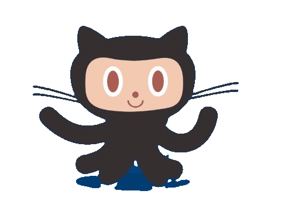
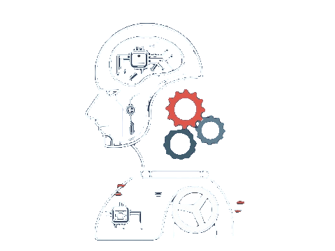
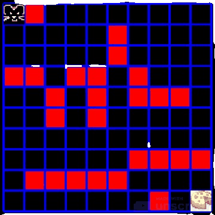

>### "You don't have to be great to start, but you have to start to be great."   -Zig Ziglar

<h1>
<a target="_blank" href="https://enigmavssut.com/">

Enigma - The Web And Coding Club

</a> 

</h1>
We welcome all freshers to Induction 2024 and we hope that you all are excited and ready to learn new stuff, and eventually get inducted into the club.

Here at Enigma, we have always given more emphasis on knowledge transfer and that is how we would start your Enigma journey too 😎

Enigma inductions are not primarily exams. They consist of 3 stages:

1. **Knowledge Transfer** 🔃
> We will be having Knowledge Transfer workshops on Open Source, Web Development, AI/ML and Competitive Programming according to the schedule that will be provided to you.

2. **Assessment** 🏹
> You would have to submit tasks provided after workshops in the respective domains which will be assessed.

3. **Personal Interview** 👨‍⚖️
> Selected candidates from the previous two stages will advance to the next stage, i.e., a Personal Interview.

__N.B.: All the tasks will have their own deadlines__

## Schedule

Let's brief the 4 -week long venture. It is a well planned path for all the newbies out there to groom up their coding skills. The whole process is to be continued for a month starting from 20th March 2023 and it will be conducted in four parts:

## Week-1 (15 - 19 March) | Open Source 
The first part of the induction you have to perform task on **Basics of Git & Github**. You will be provided with all sorts of materials which will be an apt way to learn from. 
        - [Task-1: Git Basics-I](./Open_Source/Task-1/README.md) 
        - [Task-2: Git Basics-II](./Open_Source/Task-2/README.md)
 

## Week-2 (20 - 27 March) | Web Development(Basic) 
Second week will be a walk around on one of the most popular technologies of modern world, Web Development. You will be learning the basics of web development, the languages like HTML, CSS, JavaScript and others to come on the way. 
    - [Task : HTML CSS](./Web%20Development/Task/) 
 

## Week-3 (27 March - 4 April) | Python | Application Development | Web Developement(Advanced) 
Fourth week is a walk through the revolutionary domain of AI/ML or App Development or Advances of Web Development with an exciting task to boost your interest and give you an overview of the field of your interest.
   
    - [Task: Coming Soon!!]

## Contest (31 March) | Competitive Programming 
Third week starts with a rigorous learning of competitive coding with some interesting modules. After that, their will be a series of tasks to test your understanding.

Competitive Programming 
    - [Task: Coming Soon!!])
 

## SUBMISSION:
Throughout the month, you all will explore the various domains and submit your tasks by pushing your assignments on Github and submitting pull-requests to this repository. Keep in mind without pull requests your task will **NOT** be considered. We'll be constantly evaluating your progress accordingly.

N.B. 

**Personal Interview Round to commence from 5th April**

Wishing you All the Best!  
**Team Enigma**💚
